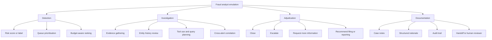
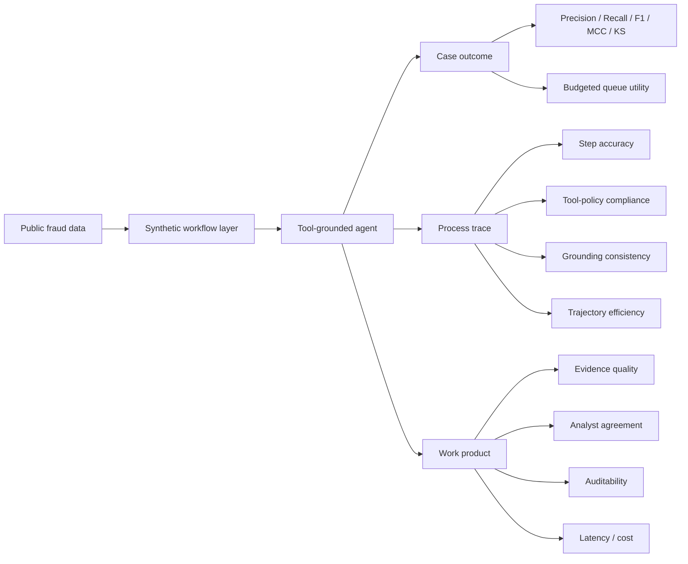

# LLM Agent Emulation of Fraud Analysts with Public Data and Synthetic Workflows

## Executive summary

The short answer is **partially yes for bounded analyst tasks, but not yet convincingly for full production-grade fraud-analyst emulation**. The literature now contains early systems that automate parts of fraud investigation, alert triage, anomaly explanation, and case reporting with LLMs. The closest direct paper I found is the **FAA framework** for credit-card fraud investigations, which uses GPT‑4o plus tools, a vision component, and report generation; on Sparkov and CCTD it reports very strong downstream fraud-detection scores and generates multi-step investigation traces, but it is evaluated on a limited sample and mostly synthetic or simplified data rather than real institutional workflows. A separate line of work, **FinFRE-RAG**, shows that public fraud datasets plus retrieval and feature selection can substantially improve LLM performance over direct prompting on structured fraud data, but this remains a transaction-level scoring setting rather than a full analyst workflow. Adjacent work in auditing, such as **AI co-piloted auditing**, **AuditCopilot**, and LLM-based ledger-anomaly detection, further supports the idea that LLMs can assist or partially emulate investigator reasoning on financial records. citeturn39view0turn37view0turn24search2turn18view2turn18view4

At the same time, the evidence base also shows the main gap very clearly. The best public fraud datasets are still either **anonymised tabular datasets** such as credit-card fraud and IEEE-CIS, **synthetic simulators** such as PaySim, BankSim, AMLSim, BAF, AMLworld, and SynthAML, or **blockchain/graph datasets** such as Elliptic, Elliptic++, and DGraph. These datasets are valuable for model development, but they usually lack the things that make a fraud analyst’s work hard in practice: customer history and KYC context, free-text case notes, tool calls, escalation policies, evidence chains, peer review, and institution-specific controls. Amazon’s FDB explicitly notes that public fraud datasets are limited, rarely include rich PII or full user history, and should not be used directly as if they were complete representations of “real fraud”; FinFRE-RAG likewise notes that among the public datasets it used, only IEEE-CIS is a relatively rich feature set and the others behave more like toy settings. citeturn31view1turn37view1turn26view5turn14search3

The most relevant adjacent evidence does **not** come from fraud papers but from **security-operations and agent-benchmark** papers. Multi-agent, tool-grounded systems such as **CORTEX** achieve materially better alert-triage performance than single-agent baselines, while **SIABench** shows that process-heavy security investigation tasks remain difficult and context-window limitations still cause frontier models to fail to complete many scenarios. General workflow benchmarks such as **SOP-Bench**, **τ-bench**, and **IntellAgent** show that long-horizon, policy-constrained, tool-using workflows are still brittle even when tasks are synthetically generated and carefully specified. This matters because fraud analysis is operationally closer to SOC triage, case management, and standard-operating-procedure execution than it is to plain binary classification. citeturn21view3turn19view13turn20view8turn18view8turn20view2turn20view4turn20view5

For novelty and publication decisions, the key conclusion is this: **a paper that simply prompts an LLM on public fraud datasets and reports F1 or AUC is unlikely to be novel**. That space is too close to existing transaction-classification work and too far from real analyst work. By contrast, a paper that contributes a **public fraud-operations benchmark**, a **synthetic-but-realistic analyst workflow simulator**, a **tool-grounded agent architecture**, or a **human-versus-agent process evaluation** would be meaningfully novel and likely publishable—especially if it demonstrates that public data plus synthetic workflows can approximate analyst work products, not just labels. The strongest white space is the combination that current literature barely covers: **public fraud data + synthetic workflow traces + auditable agent evaluation**. citeturn37view0turn39view0turn18view8turn18view9turn18view6turn21view3

The most promising research programme, therefore, is not “Can an LLM beat XGBoost on IEEE-CIS?” but “Can a tool-using, policy-constrained, auditable LLM agent perform alert triage, evidence gathering, escalation recommendation, and case-note production at useful quality using only public data plus synthetic workflows?” On the currently available evidence, that question remains open, publishable, and methodologically non-trivial. citeturn37view0turn39view0turn18view6turn21view3

## Scope and definitions

The target fraud domain is **unspecified** in your query, and that matters. “Fraud analyst” can mean notably different jobs: a **payments/card analyst** reviewing suspicious transactions; an **AML investigator** reviewing transaction-monitoring alerts and suspicious activity reports; an **account-opening or synthetic-identity analyst**; an **e-commerce trust-and-safety analyst**; a **crypto AML investigator**; or an **audit / journal-entry investigator** looking for accounting manipulation. Reviews of financial-fraud ML literature show that the dominant research domains are credit-card and payment fraud, insurance fraud, money laundering / crypto, and financial-statement or audit-related anomalies. Public regulatory material for AML also frames the work as alert review, investigation, escalation, and reporting. citeturn34view1turn34view2turn17search6turn24search4

For this report, **emulate** should not mean merely “produce a fraud label”. A useful operational definition is: an agent emulates a fraud analyst if it can take an alert or case, gather relevant evidence, reason under policy constraints, produce an auditable disposition or escalation recommendation, and generate a work product that a human reviewer could inspect and use. This definition is closer to how agent benchmarks frame real work—as a combination of **task setting**, **workflow execution**, **policy compliance**, and **work product quality**—than to bare classification. That framing is consistent with τ-bench, SOP-Bench, IntellAgent, CORTEX, SIABench, and the FAA fraud-investigation paper. citeturn20view4turn18view8turn20view5turn21view3turn19view13turn39view0

A practical taxonomy is below.

On this taxonomy, most public fraud ML papers cover only **Detection**. The more interesting LLM-agent literature starts to touch **Investigation**, **Adjudication**, and **Documentation**, but usually either in auditing or cybersecurity rather than fraud operations proper. citeturn37view0turn39view0turn21view3turn19view13

A second distinction matters for novelty: whether a paper studies **labels only** or **workflows**. Much of fraud detection research uses final labels without process traces. Yet human analysts work through procedural steps, evidence accumulation, and escalating uncertainty. That is why the most relevant public analogue literature increasingly evaluates **step accuracy, tool-policy match, grounding consistency, latency, and auditable reports**, not just F1. citeturn21view3turn38view7turn18view8turn20view5

## Prior work and evidence

A helpful way to organise the literature is by a simple two-by-two: whether the work uses **public or private data**, and whether it studies **label prediction or workflow/process execution**. Current work clusters away from the exact target you asked about.

| Evidence quadrant | Representative works | What exists now | Relation to your target |
|---|---|---|---|
| Public data + label prediction | FDB; FinFRE-RAG; UniDetect; classic Elliptic/DGraph work | Strongest public benchmark base for scoring/ranking tasks, but weak workflow realism | Necessary but insufficient citeturn31view1turn37view0turn36view3turn33search0turn26view10 |
| Private or semi-private data + label prediction / explanation | AuditCopilot; ledger-anomaly embedding work; many industry papers reviewed in 2024–2025 SLRs | Useful signals on feasibility, but often hard to reproduce | Helpful adjunct evidence, weak for open publishability citeturn18view2turn18view4turn34view1turn34view2 |
| Synthetic workflow benchmarks in general domains | SOP-Bench; IntellAgent; τ-bench | Good templates for policy-heavy agent evaluation | Strong methodological inspiration citeturn18view8turn20view5turn20view4 |
| Private workflow traces in safety-critical analogue domains | CORTEX; SIABench | Best evidence that tool-grounded multi-agent workflows can help analysts | Closest behavioural analogue, but not public fraud data citeturn21view3turn19view13 |
| **Public data + synthetic fraud workflows** | **No mature benchmark found in the surveyed literature** | White space | **Core novelty opportunity** citeturn37view0turn39view0turn18view8turn18view9 |

The broader fraud-detection literature is already crowded at the model-comparison level. A 2024 literature review covering 104 articles from 2012–2023 found that research trends are concentrated around common fraud types and that **synthetic data usage was low, below 7%** of employed datasets. A 2025 systematic review of deep-learning work analysed 57 studies from 2019–2024 across credit-card transactions, insurance claims, and financial-statement audits, and highlighted the usual issues of imbalance, interpretability, privacy, and compliance. This is important for novelty: another transaction-classification paper is competing against a very saturated field. citeturn34view1turn34view2

The direct and adjacent prior works most relevant to analyst emulation are summarised below.

| Work | Year | Methods | Data | Main reported results | Strengths | Weaknesses | Relevance to analyst emulation |
|---|---:|---|---|---|---|---|---|
| **Fraud Dataset Benchmark and Applications** | 2022 | Public benchmark library, standardised splits, multiple fraud/abuse tasks | 9 public datasets including IEEE-CIS, credit-card fraud, fraud e-commerce, Sparkov | Establishes a common benchmark; emphasises out-of-time evaluation and fraud-specific data issues | Foundational public benchmark infrastructure; highlights class imbalance, non-IID structure, and leakage risks | Not LLM-specific; mostly label-level tasks | Essential background on what “public data only” presently means in fraud research. citeturn31view1 |
| **Turning the Tables: BAF** | 2022 | Privacy-preserving synthetic suite built from real bank-account-opening data | BAF synthetic tabular suite | Released realistic, privacy-preserving large-scale bank-account-fraud data | Strong open dataset for account-opening / synthetic-identity style tasks | Still synthetic and tabular, not workflow-centric | Good substrate for analyst-emulation experiments in onboarding fraud. citeturn26view6turn30view6 |
| **Realistic Synthetic Financial Transactions for AML Models** | 2023 | Agent-based synthetic generator calibrated to real transactions; temporal graph evaluation | AMLworld public synthetic datasets | Public variants range from 5M to 180M transactions with temporal splits | Strongest open AML graph-simulation resource; explicit temporal methodology | Still synthetic; no analyst trace layer | Excellent base for synthetic AML workflows and graph-tool agents. citeturn26view4turn27view7turn27view8 |
| **SynthAML** | 2023 | Probabilistic synthetic data generation tuned on real bank data via SDV | 20,000 AML alerts and >16M transactions | Created a benchmark for AML methods when real bank data are unavailable | Large alert-centric AML resource; ties to real bank distributions | Focuses on alert tables, not investigative process | Useful for queue triage and case-level benchmarking, less so for full investigation emulation. citeturn26view5turn27view9 |
| **AI co-piloted auditing** | 2024 | GPT‑4 fine-tuning / CoT for audit tasks incl. journal-entry testing | Audit-task datasets and procedures | Demonstrates feasibility of co-piloted auditing across several tasks | Strong conceptual bridge from auditing to analyst-like work products | More copilot than autonomous agent; limited open benchmark standardisation | Very relevant for fraud-in-audit and journal-entry investigation settings. citeturn24search2turn24search15 |
| **LLM embeddings for non-semantic financial data** | 2024 | Sentence-transformer embeddings for general-ledger categorical data + classical ML | Real-world financial records / journal entries | LLM-derived embeddings outperformed baselines in selected settings | Shows LLM representations can help on structured finance anomalies | Not agentic; not public benchmarked | Relevant to the “analysis” subtask within fraud/audit workflows. citeturn18view4turn29view0 |
| **SOP-Bench** | 2025 | Synthetic SOP generation; benchmark of complex tool-using workflows across business domains | 2,000+ tasks across 12 domains | Shows agentic workflows remain difficult; larger tool registries hurt success (37% TSR vs 20.8% in one ablation) | Strong benchmark design for long-horizon procedural work | Not fraud-specific | Excellent template for a fraud-operations benchmark. citeturn18view8turn20view2 |
| **FAA fraud-investigation framework** | 2025 | GPT‑4o Assistants API; planning, info gathering, analysis, report agent, optional vision agent | Sparkov synthetic CNP data and CCTD | On 500 evaluated transactions, F1 0.9801 on Sparkov and 0.99 on CCTD; investigations averaged 5.5–7 steps, with up to 205k input tokens in vision settings | Closest direct attempt at automating fraud-investigation workflow; includes reports and evidence quality | Heavy closed-model dependence; limited sample; mostly synthetic/static datasets; no real analyst traces | **Closest direct prior art** for “emulating” analysts, but not yet a definitive public benchmark. citeturn39view0turn36view1turn38view6 |
| **Advanced real-time fraud detection using RAG-based LLMs** | 2025 | RAG on synthetic call / impersonation fraud data | Synthetic call datasets of 100/500/1000 calls | RAG-based LLM reports F1 around 0.97 on synthetic cases and beats an untrained simple LLM | Illustrates value of retrieval for synthetic fraud-like interactions | Narrow problem framing; synthetic-only; weak connection to analyst workflow | Useful supporting evidence that retrieval can stabilise performance in synthetic fraud domains. citeturn36view4 |
| **Understanding structured financial data with LLMs** | 2025 | FinFRE-RAG with feature reduction and retrieved examples; risk scoring rather than binary output | Public datasets including ccf, ccFraud, IEEE-CIS, PaySim | For Qwen3‑14B, F1 improved from 0.04 to 0.62 on IEEE‑CIS; MCC rose to 0.60; 5-level risk scoring often improved F1/MCC over binary prompts | One of the cleanest “public data only” demonstrations; explicitly studies interpretability and prompt granularity | Still transaction-level; acknowledges public datasets are limited and partly toy-like | Strong evidence for bounded **triage / scoring** emulation, not end-to-end analyst work. citeturn37view0turn19view5turn37view1 |
| **AuditCopilot** | 2025 | Structured-output LLM for ledger anomaly detection and explanation | Real anonymised ledger plus synthetic dataset | Public abstract reports strong experimental performance and emphasises governance | Explicitly positions LLM as auditing co-pilot; includes deployment caveats | Public abstract gives limited quantitative detail; not clearly public-data only | Relevant for document / ledger-centric fraud analysis and decision support. citeturn18view2turn36view2 |
| **CORTEX** | 2025 | Multi-agent, tool-grounded, auditable SOC triage over real evidence | Fine-grained workflow traces from production SOC environments | Actionable F1 improved from 0.66 to 0.78; FPR fell from 24.9% to 14.2%; latency 152.4s | Best current analogue for auditable, role-specialised investigation workflows | Security domain; uses non-public operational data | Strongest nearby evidence that high-stakes analyst work benefits from multi-agent decomposition. citeturn21view1turn21view2 |
| **SIABench** | 2026 | Agentic benchmark for security incident analysis with tool execution | 25 deep workflows and 135 alert-triage scenarios | Shows frontier models still fail many long-context scenarios; GPT‑4o failed 11/25 workflows in one setting | Process-level evaluation template; strong failure-mode analysis | Security, not fraud; public fraud equivalent absent | Suggests exactly the style of evaluation fraud-agent papers still lack. citeturn19view13turn20view8turn21view4 |
| **UniDetect** | 2026 | LLM-driven cross-chain fraud detection with graph and representation learning | Ethereum, Bitcoin-M, Bitcoin-L, plus cross-domain evaluation | Up to 8.56% improvement, at least 5.57% KS lift, and >94.58% zero-shot cross-chain detection of fraudulent accounts | Strong cross-domain generalisation story; uses common bank metric KS | Graph/account-level only; not workflow-centric | Useful for cross-domain transfer and universal fraud representations, not analyst process emulation. citeturn19view9turn36view3 |

Two patterns emerge from this table. First, **the direct fraud-LLM literature is still thin and often preprint-heavy**. Second, the papers that are behaviourally most relevant to analysts are either **auditing copilots** or **SOC triage systems**, not fraud-ops benchmarks proper. That combination supports a novelty claim for a serious fraud-analyst-emulation paper. citeturn24search2turn18view2turn39view0turn21view3turn19view13

## Data, tools, and benchmark landscape

The largest practical obstacle is simple: **public fraud data are scarce, sanitised, and rarely workflow-rich**. SynthAML states bluntly that bank transactions are highly confidential and that there are no real public bank datasets suitable for comparing AML methods. FDB makes the same point from a benchmark-construction angle: public fraud datasets rarely include rich PII or full user histories, and missing timestamps, user IDs, or raw identifiers limit investigation-style feature engineering. A 2025 review of peer-reviewed deep-learning fraud papers found that only **23 of 108** papers used publicly available datasets, while **85** relied on non-public data. citeturn26view5turn31view1turn14search4

That is why synthetic generators matter so much in this area. Regulatory and policy material also points in the same direction: the FCA’s 2024 report on synthetic data in financial services presents synthetic data as a way to support beneficial innovation but explicitly treats it as a governance and risk issue rather than a free privacy pass, while ICO guidance stresses that pseudonymisation is not the same as anonymisation. citeturn15search11turn15search2turn15search10

The most important public datasets and generators for your question are these.

| Dataset / generator | Domain | Real / synthetic | Scale and labels | Best use in analyst-emulation research | Main caveat |
|---|---|---|---|---|---|
| **Credit Card Fraud** | Card transactions | Real, anonymised | 284,807 transactions, 492 frauds over 2 days | Baseline transaction scoring and imbalance studies | PCA-only features; no workflow trace; short time window. citeturn31view1 |
| **IEEE-CIS Fraud Detection** | Card-not-present / e-commerce | Real-ish, anonymised competition data | FDB standardises it to 561,013 train / 28,527 test and 67 retained features from an original 393 | Richest public tabular benchmark for public-data-only LLM/RAG studies | Still anonymised; no case notes, tool calls, or human traces. citeturn31view1turn11search0 |
| **Fraud ecommerce** | E-commerce transactions | Real-ish public | 150k transactions with signup time, purchase time, device/browser/IP | Account-age and account-history style features | Simpler than production merchant-risk systems. citeturn31view1 |
| **Sparkov / simulated CC transactions** | Card-not-present | Synthetic | FDB: 1,296,675 train / 20,000 test; FAA cites 1,852,394 transactions with 9,651 frauds | Full-case simulation, intervention studies, workflow prototyping | Synthetic behaviour and label patterns may be learnable shortcuts. citeturn31view1turn38view2 |
| **PaySim** | Mobile money | Synthetic from real logs | Sample synthetic dataset around 23M records; simulator based on African mobile-money logs | Large-scale payments workflow simulation and ablations | No analyst traces; paper focuses on data generation realism, not investigation process. citeturn27view1turn29view2 |
| **BankSim** | Bank payments | Synthetic from aggregated Spanish bank data | 594,643 records, including 7,200 fraudulent transactions | Useful for case queues and merchant-customer network features | Older and comparatively small; still no workflow layer. citeturn26view9turn27view4 |
| **Fraud Detection Handbook simulator** | Payment cards | Synthetic, reproducible | Open simulator for legitimate and fraudulent transactions | Reproducible benchmark creation, drift injection, case-generation control | Simplified design by intent; not institution-realistic by itself. citeturn26view7turn27view10 |
| **BAF** | Bank account opening / synthetic identity | Synthetic from real data | Privacy-preserving large-scale suite; six variants published via Kaggle / repo documentation | Account-opening fraud and fairness / temporal shift experiments | Tabular suite rather than an investigation environment. citeturn26view6turn12search1turn30view6 |
| **AMLSim** | AML / banking graph | Synthetic | Multi-agent simulator with known laundering patterns | Generating graph cases, typology injection, and tool-use tasks | More a simulator than a benchmarked analyst environment. citeturn26view3turn27view11 |
| **AMLworld** | AML / graph transactions | Synthetic, calibrated | Public variants with 5M, 32M, and 180M transactions and temporal splits | Scaling experiments, temporal generalisation, graph-tool agents | No human investigative trace layer. citeturn27view7turn27view8 |
| **SynthAML** | AML alerts and transactions | Synthetic fit to real bank data | 20,000 alerts and >16M transactions | Alert triage, queue prioritisation, case-level simulations | Alert-centric, not full case-management traces. citeturn26view5turn27view9 |
| **Elliptic** | Bitcoin AML | Real public blockchain | >200k transactions, 234k edges, 166 features | Real open transaction-network investigations | Crypto only; investigation differs from bank/card ops. citeturn33search0turn32search12 |
| **Elliptic++** | Bitcoin transactions + wallet actors | Real public blockchain | 203k transactions, 822k wallet addresses, 1.27M temporal interactions | Multi-level queueing, actor vs transaction studies, graph-based triage | Crypto domain and labelled blockchain context, not retail-banking workflows. citeturn26view11turn32search1 |
| **DGraphFin** | Financial graph anomaly detection | Real finance graph | About 3M nodes, 4M dynamic edges, 1M ground-truth nodes | Graph-anomaly work and active review queues | Not a transaction log in the classic fraud-ops sense. citeturn26view10 |

A clear publishability implication follows. If a study claims “analyst emulation” but uses only static tabular datasets without synthetic environment design, it will be hard to defend that claim. By contrast, the datasets above are enough to support a serious programme if they are combined with a **synthetic case-management environment**, **policy scripts**, **tool schemas**, **entity histories**, and **review budgets**. That combination is largely missing today. citeturn31view1turn26view5turn18view8turn20view5

The most useful open-source tools and frameworks divide into two layers. The **fraud-data layer** includes FDB, BAF, AMLSim, the Fraud Detection Handbook simulator, PaySim artefacts, and Elliptic++ repositories. The **agent orchestration and evaluation layer** includes AutoGen, LangGraph, CrewAI, BFCL, τ-bench, and SOP-Bench. AutoGen explicitly positions itself as a framework for multi-agent applications; LangGraph focuses on long-running, stateful agents with human-in-the-loop support; CrewAI targets autonomous role-based orchestration; BFCL evaluates function/tool calling; and τ-bench plus SOP-Bench are more realistic for policy-heavy execution than static QA leaderboards. citeturn22search8turn22search5turn22search2turn22search7turn20view4turn18view8

## Evaluation, ethics, failure modes, and reproducibility

The evaluation problem is where most weak papers in this area will fail. Fraud models are usually judged with **AUC, precision, recall, F1, MCC, PR-style measures, and sometimes KS**, whereas workflow systems need extra dimensions such as **latency, number of tool calls, trajectory efficiency, evidence quality, grounding fidelity, and policy compliance**. FDB largely uses AUC-ROC and stresses that evaluations should be **out-of-time** because fraud is adversarial and time-dependent. FinFRE-RAG reports **F1, MCC, precision, and recall** and shows that a **5-level risk score** can outperform binary prompting. UniDetect adds **KS**, which is common in credit-scoring and bank risk settings. FAA adds **evidence quality scores**, **minimal trajectory ratio**, **token usage**, and **investigation step counts**. CORTEX moves into operational metrics with **actionable/non-actionable F1**, **false-positive rate**, **tool calls**, and **end-to-end latency**, and explicitly argues for measurements such as **step accuracy, tool-policy match, and grounding consistency**. citeturn35view2turn35view4turn37view0turn37view4turn36view3turn38view7turn38view6turn21view3

An evaluation stack suitable for publication is therefore much richer than a classification leaderboard.

A defensible benchmark for analyst emulation should include at least four families of metrics. First are **outcome metrics**, such as fraud detection at fixed review budgets, escalation correctness, and false-positive burden. Second are **process metrics**, such as step accuracy, unnecessary-step rate, policy violations, and retries or loops. Third are **work-product metrics**, such as report usefulness, evidence completeness, and citation / grounding fidelity. Fourth are **operational metrics**, such as median latency, token cost, and variance across case types. This is the lesson shared by FAA, CORTEX, SIABench, and general workflow benchmarks. citeturn38view6turn21view3turn19view13turn18view8

Ethically and legally, there are four recurring concerns. The first is **privacy and confidentiality**. Financial and AML datasets are hard to share precisely because the underlying transaction streams are sensitive; SynthAML says there are effectively no real public bank AML datasets, and FDB observes that rich PII is extremely rare in public fraud data. The second is **synthetic-data misuse**: FCA guidance treats synthetic data as valuable but risk-bearing, and ICO guidance stresses that pseudonymised data remain personal data if re-identification is reasonably possible. The third is **model governance**: U.S. banking agencies’ 2021 BSA/AML statement and 2026 revised model-risk guidance make clear that bank systems supporting compliance still sit within model-risk expectations. The fourth is **LLM-specific failure risk**. AuditCopilot explicitly names hallucinations, automation bias, prompt injection through free-text fields, and non-reproducibility as deployment risks and recommends human oversight. citeturn26view5turn31view1turn15search11turn15search2turn15search10turn17search1turn16search3turn36view2

Those concerns are not theoretical. FAA itself notes that its report does not replace all formal case processing and that the generated report is meant for analyst support rather than complete case closure. SIABench reports that context and execution limits directly prevent scenario completion in high-complexity tasks. CORTEX shows that higher-quality multi-agent decisions come with materially higher latency and token cost. In other words, fraud-agent papers need to report not just “Can the model reason?” but “Can the system reason *reliably, conservatively, and auditable enough* for high-stakes review queues?” citeturn39view0turn20view8turn21view1

Reproducibility is a particularly serious issue here. A large share of fraud-detection literature is non-public-data-based; many direct LLM-for-fraud papers are preprints; and some of the strongest workflow papers rely on private production traces. Closed-model dependencies create a further problem: FAA depends on GPT‑4o and the Assistants API, while agent performance in general is highly sensitive to tool schemas, prompts, and registry size, as SOP-Bench demonstrates. A publishable paper in this area should therefore release, at minimum, **prompt templates, tool schemas, simulator seeds, temporal splits, judge rubrics, cost logs, and process traces**, not just labels or final scores. citeturn14search4turn39view0turn20view2turn22search7

## Novelty and publishability assessment

On the surveyed evidence, the novelty question can be answered fairly crisply.

A project is **low novelty** if it does one of the following: applies an LLM or RAG wrapper to IEEE-CIS or the standard credit-card dataset; compares F1 or AUC against classical baselines; or generates explanations for tabular predictions without a workflow layer. FinFRE-RAG already makes a thoughtful public-data contribution in that space, and FAA already goes substantially further by adding investigation steps, reports, and auxiliary agents. A plain “LLM for fraud detection” paper would therefore be difficult to publish in a strong venue unless it offers a compelling methodological advance or a new benchmark. citeturn37view0turn39view0

A project becomes **moderately novel** if it introduces a sensible synthetic workflow layer on top of public fraud data—for example, policy-constrained case adjudication or tool-use over synthetic case histories—but does not release a benchmark or conduct human comparisons. This would still be useful, especially if it adapted strong ideas from CORTEX, τ-bench, SOP-Bench, and SIABench to fraud operations. But it would likely be viewed as an architecture paper more than a field-shaping benchmark paper. citeturn21view3turn20view4turn18view8turn19view13

A project is **high novelty and plausibly strong-publication material** if it contributes one of the following: a **public fraud-operations benchmark** with process traces and hidden test cases; a **synthetic fraud workflow simulator** calibrated to domain SOPs; a **human-versus-agent study** on review queues and work products; a **budget-aware decision benchmark** that reflects real analyst queues; or a **cross-domain transfer study** showing whether analyst-like workflows learned on one fraud domain or adjacent safety domain generalise to another. The literature I surveyed does not contain a mature, widely adopted public fraud benchmark that combines **public data, synthetic workflows, tool schemas, and process-level scoring**. That appears to be the most defensible novelty claim available. This is an inference from the surveyed evidence rather than a claim of strict non-existence, but it is a strong one. citeturn31view1turn18view8turn20view5turn21view3turn19view13turn39view0

The strongest publishability argument, therefore, is not “an LLM can classify fraud”, which is already unsurprising, but “a public-data-plus-synthetic-workflow benchmark can meaningfully approximate analyst work, and current agents still fail in identifiable, measurable ways.” That claim would connect an open scientific contribution to an obvious industry need. Industry reports reinforce why this matters: Nasdaq’s global financial-crime work frames the problem as systemic, ACFE’s 2024 report covers thousands of occupational-fraud cases across 143 countries and territories, and UK Finance’s official 2025 half-year figures still show very large fraud losses and over 2 million confirmed cases in just six months. citeturn9search0turn9search6turn9search5

## Research directions and publishable experiments

The best way to turn the literature gap into publishable work is to design experiments that test **analyst behaviour**, not just classifier performance. The following directions are concrete and, in my judgement, publishable.

| Direction | Core hypothesis | Required data | Evaluation plan | Why it is novel |
|---|---|---|---|---|
| **FraudOps-Bench** public benchmark | Process-level benchmarks will reveal larger capability gaps than label-only fraud benchmarks | Public fraud data such as IEEE-CIS, Sparkov, BAF, SynthAML/Elliptic++, plus synthetic case histories, policies, and tool APIs | Hidden test cases; outcome metrics plus step accuracy, grounding consistency, escalation correctness, latency, and budgeted queue utility | No mature public fraud benchmark currently combines data, tools, workflows, and auditable scoring. |
| **Synthetic case-management simulator** | Workflow realism matters more than raw model size for analyst-like performance | Public datasets + synthetic CRM/KYC/customer history/payment history + SOP scripts derived from public guidance | Compare architectures under the same environment; ablate realism knobs such as drift, missing evidence, and distractor tools | Moves beyond static tabular fraud datasets into operational emulation. |
| **Role-specialised multi-agent fraud triage** | Specialisation reduces false positives and improves auditability relative to single-agent ReAct loops | FraudOps-Bench or equivalent synthetic environment | Compare single-agent, planner-executor, and role-specialised teams; measure FPR, actionable recall, evidence quality, and cost | Strongly inspired by CORTEX but untested in fraud operations. citeturn21view3 |
| **Temporal drift and zero-day typology study** | Agents trained/tested with drift-aware workflows will generalise better to new fraud patterns than agents optimised on pooled static data | Temporally ordered public data such as IEEE-CIS, AMLworld, Elliptic++ plus injected new typologies | Strict out-of-time evaluation; worst-period performance; degradation curves; queue overlap under fixed review budgets | Targets a core real-world weakness that public fraud papers often under-address. citeturn35view2turn27view8turn32search4 |
| **Human–AI co-review experiment** | Agents improve novice throughput more than expert accuracy; autonomous mode remains weaker on ambiguous cases | Synthetic but realistic case packages; recruited human analysts or proxies such as trained annotators | Time-to-disposition, agreement with expert gold labels, confidence calibration, workload reduction, and usefulness ratings | Provides the strongest evidence for “emulation” as a work claim rather than a model claim. |
| **Privacy leakage audit for synthetic fraud data** | Naive LLM-generated synthetic cases leak more memorisable patterns than simulator- or SDV-based approaches | Synthetic datasets made by multiple generators; canary records or controlled source data where possible | Membership-inference and nearest-neighbour leakage tests; downstream utility/fidelity trade-offs | Directly addresses a major deployment concern raised by FCA/ICO and Microsoft’s privacy-audit work on LLM-generated synthetic data. citeturn15search11turn15search2turn24search1 |
| **Cross-domain transfer from SOC to fraud** | Tool-grounded analyst architectures transfer better across domains than pure fraud classifiers do | SIABench/CORTEX-style procedural components adapted to fraud benchmarks | Train architecture patterns on one domain, test on fraud tasks; measure transfer hit or miss at the process level | Novel bridge between adjacent analyst domains with clear methodological value. |
| **Decision-theoretic review-queue benchmark** | Cost-weighted and budget-aware metrics predict analyst usefulness better than AUC or headline F1 | Any public fraud dataset with synthetic case burden and customer-friction costs layered on top | Precision@k, recall at review budget, cost-weighted utility, false-positive burden, queue overlap, analyst calibration | Reorients benchmarking away from static classifier metrics toward operational decision support. |

If a single paper must be chosen, the best candidate is probably a combination of the first three directions: build **FraudOps-Bench**, evaluate **single-agent vs multi-agent** designs, and include a **human co-review** component on a carefully stratified subset of cases. That would align your work with the strongest recent agent-evaluation literature while addressing a gap that the fraud literature clearly still has. citeturn18view8turn20view4turn20view5turn21view3turn19view13

## Open questions and limitations

A few uncertainties remain. Much of the most directly relevant LLM-for-fraud literature is still **preprint-stage**, and some public abstracts do not expose detailed quantitative tables, so not every promising paper is equally mature or equally reproducible. The exact **target fraud domain** in your brief is unspecified, and novelty depends heavily on whether the goal is payments, AML, account opening, crypto, or audit fraud. Finally, the strongest analogue work on process-level analyst emulation currently sits in **security operations**, not in public fraud benchmarks, so some of the novelty assessment here is necessarily an inference from adjacent domains rather than a one-to-one literature match. citeturn18view2turn39view0turn21view3turn19view13

The highest-confidence conclusion nonetheless stands: **there is enough adjacent evidence to make the project plausible, but not enough direct prior art to make it crowded**. That combination is exactly what usually justifies a serious benchmark-and-systems paper. citeturn37view0turn39view0turn18view8turn21view3